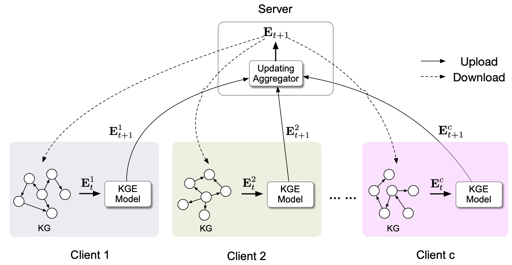

*****************************************************************

We move our code repository to [zjukg/FedE](https://github.com/zjukg/FedE), and maintain this project there. If you are interested in this code, please go to [zjukg/FedE](https://github.com/zjukg/FedE).

*****************************************************************

# FedE

This repository is the implementation of IJCKG 2021 paper: [FedE: Embedding Knowledge Graphs in Federated Setting](https://dl.acm.org/doi/fullHtml/10.1145/3502223.3502233). In this work, we propose a Federated Knowledge Graph Embedding framework, FedE, focusing on learning knowledge graph embeddings by aggregating locally-computed updates.

<p align="center"></p>


## Requirements
+ python
+ PyTorch
+ NumPy
+ tqdm

## Date 
We put our experimential datasets in ``./data``, and give data details in its README.

## Training and Testing

We give the example scripts for reproducing our experimental results in ```./script```, you can try following commands. To properly run these scripts, you may specify the GPU index in scripts.

### 1. FedE, TransE, on dataset FB15k-237-Fed3
```bash
sh ./script/run_fb237_fed3_transe_fede.sh
```

### 2. Isolation, TransE, on dataset FB15k-237-Fed3
```bash
sh ./script/run_fb237_fed3_transe_isolation.sh
```

After finishing above two experiments on the setting of FedE and Isolation, you can run model fusion based on the example script:

```bash
sh ./script/run_fb237_fed3_transe_fede_model_fusion.sh
```

### 3. Collection, TransE, on dataset FB15k-237-Fed3
```bash
sh ./script/run_fb237_fed3_transe_collection.sh
```


## How to Cite

If you use or extend our work, please cite the following paper:

```
@inproceedings{FedE,
  author    = {Mingyang Chen and
               Wen Zhang and
               Zonggang Yuan and
               Yantao Jia and
               Huajun Chen},
  title     = {FedE: Embedding Knowledge Graphs in Federated Setting},
  booktitle = {IJCKG'21: The 10th International Joint Conference on Knowledge Graphs,
               Virtual Event, Thailand, December 6 - 8, 2021},
  pages     = {80--88},
  publisher = {{ACM}},
  year      = {2021},
  url       = {https://doi.org/10.1145/3502223.3502233},
  doi       = {10.1145/3502223.3502233},
  timestamp = {Thu, 27 Jan 2022 16:44:51 +0100},
  biburl    = {https://dblp.org/rec/conf/jist/ChenZYJC21.bib},
  bibsource = {dblp computer science bibliography, https://dblp.org}
}
```

